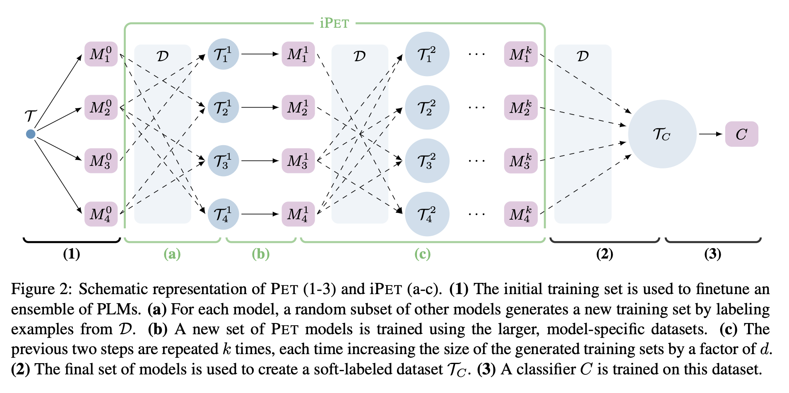

## Text classification

- Лучший энкодер для классификации текстов - ruroberta
- Если классов очень много, после обучения модели смотрим кластеризацию - есть ли очень похожие классы? сливаем если что, чтобы модель не путалась, если можно

Если несбалансированные классы, можно использовать следующие техники:
- для крупных классов можно взять undersampling
- для редких классов методы аугментации - берем эмбеддинг текста и эмбеддинги аугментируем через SMOTE (то есть для одного эмбеддинга редкого класса получаем 5 финальных примеров)

## "Exploiting Cloze Questions for Few Shot Text Classification and Natural Language Inference" 
**Paper**: https://aclanthology.org/2021.eacl-main.20.pdf

**Inspiration**:
- solving a task from only a few examples becomes much easier when we also have a task description, i.e., a textual explanation that helps us understand what the task is about. So far, this idea has mostly been considered in zero-shot scenarios where no training data is available at all.
- PET works in three steps: First, for each pattern a separate PLM is finetuned on a small training set T . The ensemble of all models is then used to annotate a large unlabeled dataset D with soft labels. Finally, a standard classifier is trained on the soft-labeled dataset. 

**Algorithm**:
- We assume access to a small training set T and a (typically much larger) set of unlabeled examples D
- We define a number of `patterns P`

- We define a `verbalizer` that converts token to classification label

- Then for each pattern P we train a separate MLM model that predicts at `[MASK]` position a token converted to label with the help of `verbalizer`. The loss function used is MLM loss combined with cross-entropy loss. 
- At the next step the big unlabeled set is scored by all models/patterns separately and soft-labels are assigned by aggregation of predictions.
- A standard classifier if trained on these soft labels which is a final model to be used.

**Conclusions**:
- Works better than classic fine-tuning (RoBERTa base compared) from 10 to 100 examples per class with score from 45% to 89% on 10 examples for different datasets
- Have an iterative alternative iPET which is slightly performant but much slower
- Need a big unlabeled set a hand-crafted patterns

## "Making Pre-trained Language Models Better Few-shot Learners"
**Paper**: https://aclanthology.org/2021.acl-long.295.pdf

**Implementation**: https://github.com/princeton-nlp/LM-BFF

**Inspiration**: 
- Prompt-based prediction treats the downstream task as a (masked) language modeling problem, where the model directly generates a textual response (referred to as a label word) to a given prompt defined by a taskspecific template. We address this issue by introducing automatic prompt generation, including a pruned brute-force search to identify the best working label words, and a novel decoding objective to automatically generate templates using the generative T5 model — all of which only require the few-shot training data.

- Inspired by GPT-3  we adopt the idea of incorporating demonstrations as additional context. We develop a more refined strategy, where, for each input, we randomly sample a single example at a time from each class to create multiple, minimal demonstration sets. We also devise a novel sampling strategy that pairs inputs with similar examples, thereby providing the model with more discriminative comparisons.

**Algorithm**:
- Auto-generate promt-like template
- Find with LM good label names -> Get final template with label names to compose promts for LM
- Fine-tune the MLM model + cross-entropy loss
- If needed, add "demonstrations" - each promt is followed by pair of positive and negative examples. The authors proposed to select positive and negative pair from the similar

**Conclusions**: 
- only use a few annotated examples as supervision
- experiment with RoBERTa-large and 16 training examples for each class. Roberta works significantly better than BERT! Used only -large versions.
- A good option is to use prompt-based fine tuning with manual templates. Adding demonstrations and incorporating  auto generation of templates results in 1% improvement. The base approach is almost always better than standard fine-tuning 
- it is important to clarify that LM-BFF favors certain tasks which:
  -  (1) can be naturally posed as a “fill-in-the-blank” problem;
  -  (2) have relatively short input sequences; 
  -  (3) do not contain many output classes.
  Issues (2) and (3) might be ameliorated with longer-context language models (e.g., Beltagy et al., 2020). For tasks that are not straight-forward to formulate in prompting, such as structured prediction, issue (1) is more fundamental. 

## Sentence embeddings and ZMap
**Paper**: https://few-shot-text-classification.fastforwardlabs.com/
**Implementation**: https://github.com/fastforwardlabs/few-shot-text-classification

**Algorithm**:
- We can generate an approximation, by learning a mapping between individual words in SBERT space to those same words in w2v space. We begin by selecting a large vocabulary of words (we’ll come back to this) and obtaining both SBERT and w2v representations for each one. Next, we’ll perform a least-squares linear regression with l2 regularization between the SBERT representations and the w2v representations (Z-matrix).

- This method involves learning another mapping, this time between the documents and their labels—but we need to be careful not to overfit to our few annotated examples. One way to accomplish this is to modify the regularization term in the linear regression. Before looking at this modification, let’s take a closer look at the traditional objective function for least-squares with l2 regularization in order to get a feel for how this is accomplished. The first term essentially tells W how to match an input, X, to an output, Y. The second term we’ll modify so that elements of the weight matrix are now pushed towards the identity matrix. If we only have very few examples, W will likely be quite close to the identity matrix. This means that when we apply W to our representations, SBERT(d)ZW will be very close to SBERT(d)Z. This is exactly what we want: to rely strongly on our original representations in the face of few examples (W-matrix).

- Our final classification procedure now looks like this:

**Conclusions**:
- 100 examples for each label is needed for stable learning with this algorithm
- For fitting matrix Z the authors found optimal vocabulary of size 20 000 - 40 000 words.
- Performance was assessed at all three steps: 
  -  based on cosine similarity between SBERT embedding of text and W2V embedding of label
  -  + using Z-map adds + 10%
  -  + using W-map (algorithm becomes supervised) adds + 
- Limitation of the latent text embedding method: not only do category labels need to have semantic meaning, they also need to have specific semantic meaning to maximize the method’s utility (for example posts categories should have distinct names, and category like "funny" could be absolutely omplicates as humour appears in many posts and all these posts will by classified as "funny"). It’s not enough to have a few labeled examples for training or validation; care must be taken when deciding what the label names themselves will be. This method relies on labels laden with meaning, and that possess some semantic relationship to the text documents you wish to classify. If, for example, your labels were Label1, Label2, and Label3, this method would not work, because those labels are meaningless. In addition to being meaningful, label names should not be too general. As we saw, the words “World” and “Funny” were too broad and all-encompassing to be practical label names. 
- The performance of the method do not increase with more data and other classic method should be considered or checked.

## Lbl2vec
**Paper:** Schopf, T.; Braun, D. and Matthes, F. (2021). Lbl2Vec: An Embedding-based Approach for Unsupervised Document Retrieval on Predefined Topics

**Article:** https://towardsdatascience.com/unsupervised-text-classification-with-lbl2vec-6c5e040354de

**Implementation:**  https://github.com/sebischair/Lbl2Vec

**Algorithm:**
- The key idea of the algorithm is that many semantically similar keywords can represent a category.
Steps:
1) In the first step, the algorithm creates a joint embedding of document, and word vectors. iterative training on the interleaved PV-DBOW and Skip-gram architectures enable us to simultaneously learn word and document embedding that share the same feature space.
2) Once documents and words are embedded in a shared vector space, the goal of the algorithm is to learn label vectors from previously manually defined keywords representing a category. Finally, the algorithm can predict the affiliation of documents to categories based on the similarities of the document vectors with the label vectors. Beginning at the document embedding with the highest cosine similarity, we now successively add each document embedding to a set of candidate document embeddings (while min number of documents in category is achieved or similarity reach threshold)
3) To ensure a more accurate label embedding later, we now clean outliers from the resulting set of candidate document embeddings.Therefore, we apply local outlier factor (LOF) (Breunig et al., 2000) cleaning. If the LOF algorithm identifies document embeddings outlier with significantly lower local density than that of their neighbors, we remove these document embeddings. Hence, we receive the set of relevant document embeddings for topic. 
4) Finally, we compute the centroid of all document embeddings and define this as our label embedding

At prediction time, the similarity of documents to label vectors will be used to classify text documents.

**Conclusion:**
- The core of the model - model to jointly embed words and documents. Big training set is needed for fitting this model (10k in paper)
- The authors propose the method to get keywords for each class/topic in supervised manner - Haj-Yahia et al. (2019) "Towards unsupervised text classification leveraging experts and word embeddings."
- Using similar keywords to describe a topic yields better Lbl2Vec models 
- No support was found for the assumption that Lbl2Vec can yield better topic models if we use more topic-related keywords, as there is insufficient evidence to infer a relationship between X1 and Y. 
- To obtain a more precise topic representation by Lbl2Vec, we need to define topic keywords making them as dissimilar as possible to the keywords of other topics

## Induction Networks for Few-Shot Text Classification
**Paper**: https://arxiv.org/pdf/1902.10482.pdf

**Общая идея:**
- Учимся извлекать знание о том, как из эмбеддингов саппорт сета извлечь описание класса. Основано на идее meta learning - learn several tasks (datasets) of the same type (classification). Relation Induction Networks
Мы не пытаемся научиться разделять классы, а учимся выделять общее из саппорт сета, то есть итоговый алгоритм будет принимать на вход саппорт сет + пример для скоринга и выдавать ответ, похожи или нет

**Conclusions:**
- need a big dataset of similar tasks on which to pretrain model for few shot classification (for example, for a task of sentiment analysis for freezers we need labeled sentiment sets for > 10 other categories

## Общие мысли
**Базовые подходы:**
1) Задача в получении эмбеддинга класса на основании маленького количества примеров (саппорт сет - набор примеров одного класса). Затем для нового примера измеряем близость до эмбеддингов классов

2) Пример от Тинькофф: https://www.youtube.com/watch?v=m0zv3cRk1qA&list=PLLrf_044z4JrM_7YvA0oTgIrZMbrXYisA&index=35

3) Good baseline - fine-tuning. There are methods to decrease variance (Howard and Ruder, 2018 "Universal language model fine-tuning for text classification"; Dodge et al., 2020 "Fine-tuning pretrained language models: Weight initializations, data orders, and early stopping"; Lee et al., 2020 "Mixout: Effective regularization to finetune large-scale pretrained language models"; Zhang et al., 2021 "Revisiting fewsample BERT fine-tuning")
