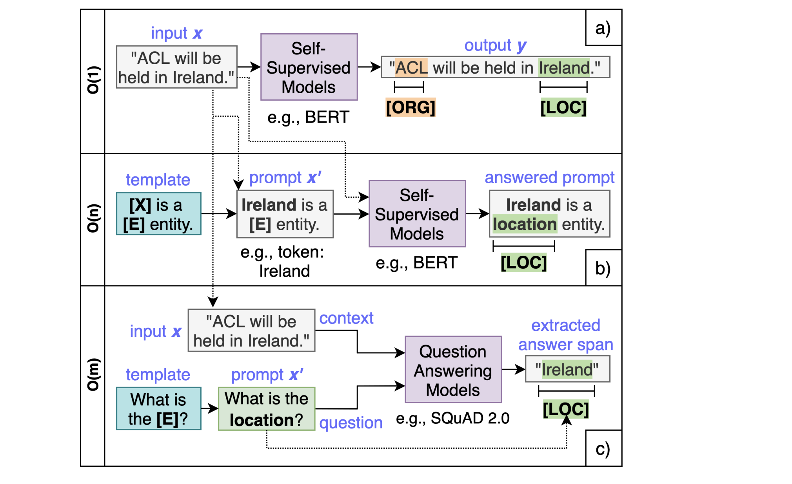

NER example https://github.com/Erlemar/Erlemar.github.io/blob/master/Notebooks/ner_sberloga.ipynb

### О том, как делать NER модели:
- важно иметь достаточно разметки для начала работы. Можно ориентироваться на 1 000 документов
- хороший безйлайн - регулярки. Если что-то можно цеплять регулярками, лучше воспользоваться ими. Регулярки хорошо подходят для единообразных сущностей, тогда достаточно не так много примеров.
- Если тексты сущностей разнообразны, необходима модель. Для BiLSTM + CharCNN + CRF нужно имного данных, больше чем для БЕРТа.
- Очень хорошо в NER работает CRF - сглаживает острые углы (например, не дает сущностям прерываться)
- В качестве body лучше использовать BiLSTM
- При обучении обычно сначала делают файн-тьюн головы при замороженном эмбеддере, а потом дообучают все вместе (на каждую итерацию 5-10 эпох)
- Предобработка NER: negative under sampling (каждая сущность должна присутствовать не более чем в 50% сущностей, иначе модель будет пытаться в каждом тексте выделять сущность - даже там, где её нет)
- Анализ ошибок: сохраняем в faiss индекс вектор каждого сэмпла. Далее берём одну ошибку из теста и ищем в индексе ближайшие в трейне, просматриваем на предмет недоразметки этой сущности в найденных документах, исправляем разметку
- Чем больше перекрытие при разметке, тем лучше модель
- Чем глубже модель, тем выше качество (но при этом нужно больше данных)

### Сложности в задаче NER:
1. Самое главное - разметка. Если ее достаточно (обычно от 200-500 примеров), модель может хорошо обучиться. При этом на первых этапах разметки всегда важно делать кросс-разметку и оценивать ее согласованность. На основе несостыковок вносятяся изменения в инструкцию для разметки, изменения обсуждаются с разметчиками и происходит переход к следующему циклу разметки.
2. Чем проще сущности - тем лучше. Если даже разметчик сильно сомневается, к какому типу сущности отнести данный случай, модели будет еще сложнее. Необходимо максимально разграничить классы, насколько это возможно.
3. Встречаются случаи, когда одно слово является частью двух разных сущностей, например, "Bank of China" является сущностью типа ORG, при этом слово China относится также к сущностям типа LOC. Задачу выделения таких сущностей называют Nested NER. К ней есть множество подходов, но самое простое из решений - использование Multilabel подхода, когда каждый токен может быть отнесен к любому количеству типов сущностей.
4. Если для сущностей есть иерархия (например, сущность Тип организации, подтип ЮЛ, ИП, кооператив), можно использовать two-level NER: У модели будет две головы. Первая --- стандартная, как для обычного NER, на типы (O, B/I_Entity, ...). Вторая --- только для подтипов. Вторая состоит из одного слоя для multihot-подтипов и одного для single-hot. Они отличаются только лоссом, поэтому разберем на примере single-hot. Пусть есть сущность A с подтипами a1, a2, a3, C с подтипами c1, c2 и B без подтипов. Размер слоя будет 2 (количество сущностей, имеющих подтипы) x 3 (максимальное число подтипов среди таких сущностей). Во время обучения, когда встречается метка A:a2, считается лосс для A в первой голове и лосс по a2 в первой строке тензора во второй голове (софтмакс по трем значениям). Во время предсказания вторая голова активируется, только если первая выбрала соответствующий тип.
5. Очень хорошо работает Negative Sampling при большом дисбалансе классов: если текст сущностей занимает 1-5% от всего текста, необходимо повысить баланс классов для модели NER, например, разбив текст на куски и обучивклассификатор наличия сущностей в тексте. Таким образом, на этапе обуения мы обучаем NER только на сегментах, предсказанных классификатором

### Few shot NER
Отдельной областью исследований является изучение подходов к решению задачи Few shot NER, когда для выделения определенного типа сущностей достаточно несколько обучающих примеров (до 100)
Одно из направлений - решение этой задачи как задачи QA (question answering).
Есть 2 направления: Extractive QA и Generative QA.

<b> QaNER: Prompting Question Answering Models for Few-shot Named Entity Recognition (https://arxiv.org/pdf/2203.01543.pdf) </b>

Реализация: https://github.com/dayyass/QaNER
+ хорош для few shot
+ решает задачу nested NER, так как запросы разделены
- на больших данных обычный подход обгоняет qaNER
- помимо обучения на разметке необходимо предобучить на squad
- сложность - O(m), m - количество типов сущностей
- есть сложности с обработкой предиктов/разметки, когда одна сущность может встречаться несколько раз в тексте

Как обучить? 
Обучаем Берт на squad
Преобразуем датасет в нужный promt-context-labels формат
Обучаем на разметке token classification
Постпроцессим сущности

<b> Other Few Shot Approaches </b>
https://habr.com/ru/company/sberbank/blog/649609/

### Статьи
CRF - https://medium.com/data-science-in-your-pocket/named-entity-recognition-ner-using-conditional-random-fields-in-nlp-3660df22e95c
CRF https://medium.com/@phylypo/nlp-text-segmentation-using-conditional-random-fields-e8ff1d2b6060
Using External knowledge https://aclanthology.org/P18-2039.pdf
