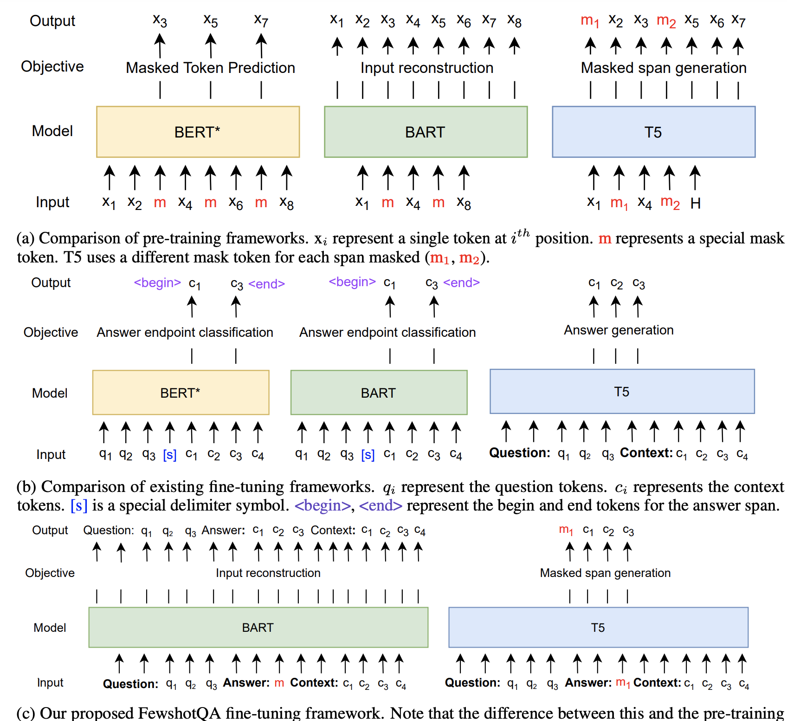
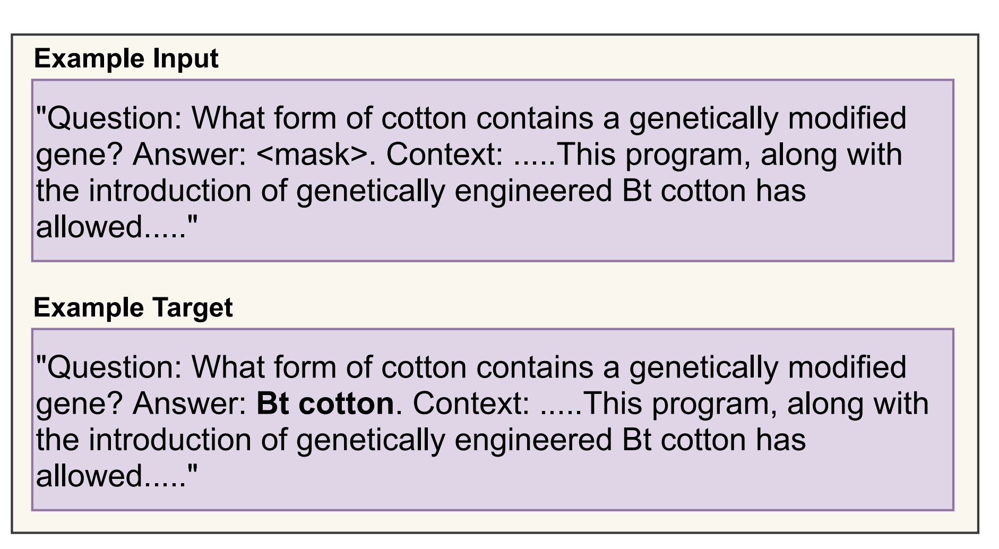

## Задача:
Поиск ответа на вопрос в тексте статьи или поиск документа с ответом на вопрос среди множества документов. 
Выделяют open domain QA и knowledge based QA. Вторые в качестве источника имеют под собой Википедию или граф знаний для поиска ответа

## Примеры имплементации:
Лонгформер https://github.com/patil-suraj/Notebooks/blob/master/longformer_qa_training.ipynb
Course transformers https://huggingface.co/course/chapter6/3b?fw=pt, https://huggingface.co/course/chapter7/7?fw=pt

## Datasets:
Обзор датасетов: https://arxiv.org/abs/2206.15030
- Список англоязычных датасетов: http://nlpprogress.com/english/question_answering.html
- Самый популярный корпус для обучения QA моделей - SQuAD. Его особенность - ответ на вопрос представляет собой спан исходного текста
- Датасеты для чат-ботов https://analyticsindiamag.com/10-question-answering-datasets-to-build-robust-chatbot-systems/
- FAQ dialog datasets https://paperswithcode.com/dataset/doqa

Русскозычные
- SberQUAD

## Методы

### Классификация:

По способу предоставления ответа:
- Extractive QA: ответ извлекается из контекста 
- Generative QA: ответ генерируется 

По наличию контекста:
- Open QA: Вопрос формируется из контекста
- Closed QA: Контекст не предоставлен и ответ генерируется моделью

1. Самое простое решение - BERT-QA. Данные подаются в формате [CLS] QUESTION [SEP] context [SEP] -> (start_pos, end_pos)
2. Дообучить языковую модель так, чтобы вектор вопроса и вектор ответа были близки (что-то типа LABSE). Ещё если есть большая обучающая выборка, можно просто двумя несвязанными энкодерами получить представления вопроса и ответа и обучать модель минимизировать косинусное расстояние между этими представлениями. Из-за того, что энкодеры не связаны, непохожесть ответа на вопрос никак не помешает -  contrastive learning
3. Если ответ нужно искать в нескольких документах, то нужный документ можно искать по tf-idf/bm25/passage ranking models(https://huggingface.co/cross-encoder/ms-marco-TinyBERT-L-2), а затем поиск ответа в найденной статье (odqa/kbqa). Статьи можно разбивать на блоки (разного размера и с перекрытием), обычно это улучшает качество ответа. Каждый блок эмбеддится бертом (в один вектор), и потом ищется ответ среди более длинных блоков, включавших в себя блоки, оказавшиеся ближайшими соседями к эмбеддингу запроса.
Матчить по близости можно через faiss например (cosine similarity in most nearest cluster)
4. Генерация ответа с помощью BART или T5

Тулзы:

- Можно попробовать предобученные сетки для такого, например: https://demo.allennlp.org/open-information-extraction
- Про разные подходы можно прочитать здесь: https://paperswithcode.com/task/open-information-extraction
- Перед использованием можно ещё пройтись вот этой сеткой: https://github.com/google-research/language/tree/master/language/decontext

### Few Shot
1. FewshotQA: A simple framework for few-shot learning of question answering tasks using pre-trained text-to-text models (https://arxiv.org/pdf/2109.01951.pdf) -  EMNLP 2021
Key points:
- For instance, (Ram et al., 2021) show that, when only 16 training examples are available, the Robertabase (Liu et al., 2019) and SpanBERT-base (Joshi
et al., 2020) obtain a F1 score of 7.7 and 18.2 respectively on SQuAD (Rajpurkar et al., 2016). This is far lower than the F1 score of 90.3 and 92.0 when using the full training set of >100000 examples. Through experimental analysis, we observe that this degradation is majorly attributed to the disparities between fine-tuning and pre-training frameworks (a combination of the input-output design and the training objective).
- We construct the input as a concatenation of the question, a mask token and context (in that order) and fine-tune a text-to-text pre-trained
model using the same objective used during its pre-training to recover the answer.

- The choice of text-to-text models in our system allows us to use to the standard encoder-decoder objective that maximizes the log likelihood of the text in the ground truth target from the output of the model.

- From 16 to 128 fewshotBART and fewshotT5 has significant uplift compared to classic BERT, T5 and BART QA
- Size of model makes sense - up to 0.1 F1 uplift on all sample sizes

2. "Few-Shot Question Answering by Pretraining Span Selection", to appear at ACL 2021 (https://arxiv.org/pdf/2101.00438.pdf)
Implementation: https://github.com/oriram/splinter

## Применение:
Онлайн(автоматический)-консультант на сайте - а-ля выдача ответа пользователю поиском по faq
https://in.springboard.com/blog/nlp-project-automated-question-answering-model/

### FAQ retrieval
Пример подхода к решению задачи FAQ (2 000 пар в FAQ) https://arxiv.org/abs/1905.02851

")

Multilingual dataset and approach https://www.researchgate.net/publication/354889556_MFAQ_a_Multilingual_FAQ_Dataset
Multi domain https://www.researchgate.net/publication/341148105_DoQA_-_Accessing_Domain-Specific_FAQs_via_Conversational_QA

Существующие разработки:
- https://developers.sap.com/tutorials/conversational-ai-faq-chatbot-beginner.html
- https://research.aimultiple.com/faq-chatbot/
- https://www.intercom.com/automated-answers?on_pageview_event=automated_answers_footer

Русские системы:
- https://bothelp.io/ru/templates/faq-ru
- https://www.helpdeski.ru/tags/chat_boty_dlja_podderzhki/

