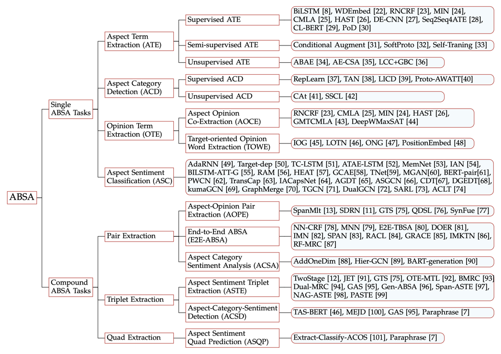

# Aspect-based sentiment analysis

## Постановка задачи
Целью данной задачи является выделение отношения (эмоциональной окраски) не в целом, а относительно определенных характеристик, то есть классифицировать отношение (позитивное/негативное) недостаточно, необходимо четкое понимание - по отношению к чему выражено отношение и какие слова выражают отношение и саму характеристику.
В данной задаче используются следующие термины, означающие различные подзадачи:
- аспект (характеристика) - aspect
- отношение (тональное слово) - opinion
- сентимент (тональность) - sentiment
- аспектная категория (область, к которой относится характеристика) - aspect category

Учитывая то, что в зависимости от конечной задачи некоторые элементы могут быть неинтересны, рождается некая иерархия задач, цеью которой является создание унифицированного подхода для <b> одновременного решения всех необходимых задач </b>.

Как показано в статье "A Survey on Aspect-Based Sentiment Analysis: Tasks, Methods, and Challenges" (https://arxiv.org/pdf/2203.01054.pdf) можно выделить следующие позадачи:

Второй подход - Pipeline. Предполагается, что так как решение нескольких задач одновременно одной моделью - довольно сложно, то можно разделить итоговое решение на этапы, так что несколько моделей будут применяться последовательно, при том каждая модель решает только одну (свою) задачу. Например, если необходимо решить задачу выделения пар "(аспект, тональность)", то необходимо разработать 2 модели: первая будет выделять аспекты, вторая будет для каждого аспекта находить тональные слова. При всей логике этого подхода на практике есть один значительный недостаток - "error propagation issue", то есть сложение ошибок всего пайплайна. То есть если модели на первых этапах недостаточно качественны, их ошибки будут "просачиваться" до самой последней модели и портить финальное качество.

## На практике

Данная задача имеет 2 сложности:
1. Ввиду разнообразия языка и использования комбинаций упомянутых элементов, для решения комплексной задачи, выделяющей несколько элементов, необходимо много разметки. В общедоступных датасетах - от 3 000 пар.
2. Зависимость от домена. Модель, обученная выделять отношение к характеристикам одежды, не поможет проанализировать отношение к недвижимости, ввиду различия между тональными словами (что для одного домена хорошо, для другого - плохо) и совершенно новым набором аспектных слов.

Из открытых источников - как обычно решают данную задачу в индустрии:
1. Опыт Яндекса - анализ отзывов (https://habr.com/ru/company/yandex/blog/665132/)
Разработчикам была поставлена общая задача - агрегация отзывов о местах на карте в виде оценки по неким категориям-основным характеристикам места. Для решения задачи на первом этапе необходимо решить задачу выделения аспектных категорий (сентименты уже есть в виде рейтинга места из того же отзыва). Для этого фиксировался один домен. Для этого домена экспертами определялся список аспектных категорий, например, для домена "Кафе и рестораны" выделены аспектные категории «еда», «чистота», «цена», «расположение», «персонал», «напитки», «музыка», «завтраки». После чего разработчики обучили модель на классификацию текста по аспектной категорий, то есть в данном случае 8 моделей-меток. При этом для выделения фраз, которые относятся к аспектной категории, авторы использовали self attention веса из BERT.

2. Eureka
3. В нашем кейсе - анализ звонков - найденных случаев в виде 2 000 штук итого, из них 500 пар аспект-мнение не хватило для обучения полноценной модели, вследствие чего был выбран pipeline-подход - классификация текста на наличие аспекта и/или мнения, а затем отдельная модель выделяет уже нужные сущности.

