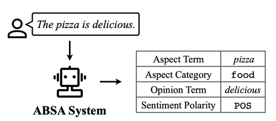

# Aspect-based sentiment analysis
Целью данной задачи является выделение отношения (эмоциональной окраски) не в целом, а относительно определенных характеристик, то есть классифицировать отношение (позитивное/негативное) недостаточно, необходимо четкое понимание - по отношению к чему выражено отношение и какие слова выражают отношение и саму характеристику.
В данной задаче используются следующие термины, означающие различные подзадачи:
- аспект (характеристика) - aspect
- отношение (тональное слово) - opinion
- сентимент (тональность) - sentiment
- аспектная категория (область, к которой относится характеристика) - aspect category

Учитывая то, что в зависимости от конечной задачи некоторые элементы могут быть неинтересны, рождается некая иерархия задач, цеью которой является создание унифицированного подхода для <b> одновременного решения всех необходимых задач </b>.

Существует несколько различных постановок этой задачи. Как показано в статье "A Survey on Aspect-Based Sentiment Analysis: Tasks, Methods, and Challenges" (https://arxiv.org/pdf/2203.01054.pdf) можно выделить следующие позадачи:

For
example, the aforementioned aspect-opinion pair extraction
problem aims to extract all (aspect term, opinion term) pairs.
Therefore, one straightforward pipeline-style solution is to
first extract aspect terms, then identify the corresponding
opinion terms for each predicted aspect term.
However, it suffers from the error propagation issue,
i.e., the errors produced by early models would propagate
to the later models and affect the final overall performance
