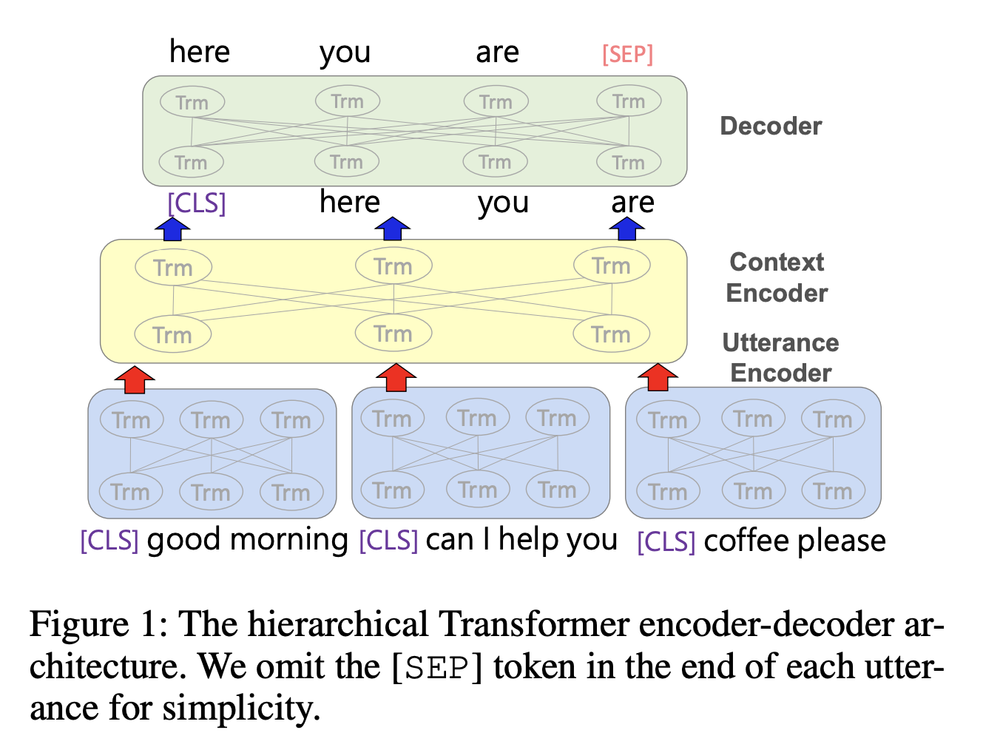
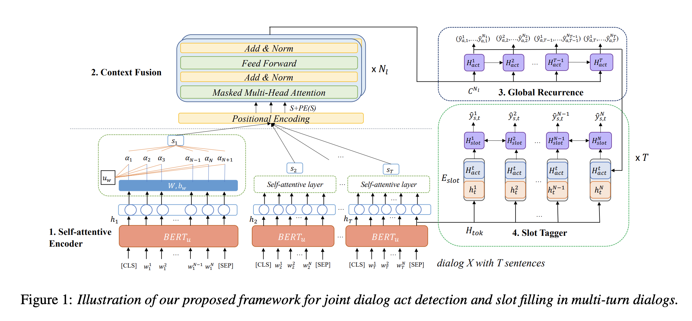
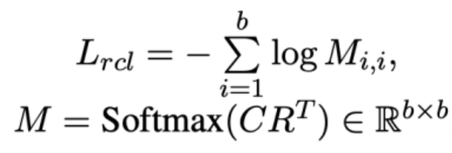

# DialogBERT: Discourse-Aware Response Generation via Learning to Recover and Rank Utterances
URL: https://arxiv.org/pdf/2012.01775.pdf

Используется иерархический БЕРТ (один - на уровне одной реплики, кодирующий токены, и второй - на уровне диалога, кодирующий реплики)
Целевая задача - предсказание следующей реплики чат-ботом

Дообучение БЕРТ на двух задачах:

1) Masked utterance regression - предсказываем эмбеддинг маскированной реплики
2) Distributed Utterance Order Ranking - перемешиваем реплики и предсказываем порядковый номер каждой реплики (для получения итоговой последовательности сортируем реплики по выходному скору - чем больше значение, тем позже в ряду реплика)

# A Context-Aware Hierarchical BERT Fusion Network for Multi-turn Dialog Act Detection
URL: https://www.isca-speech.org/archive/pdfs/interspeech_2021/wu21d_interspeech.pdf

Используется иерархический БЕРТ (один - на уровне одной реплики, кодирующий токены, и второй - на уровне диалога, кодирующий реплики)
Целевая задача - предсказание интентов и слот филлинг. Создана архитектура, которая позволяет лучше решать целевую задачу. Обучение - на датасетах для intent classification

# TOD-BERT: Pre-trained Natural Language Understanding for Task-Oriented Dialogues”.
URL: https://aclanthology.org/2020.emnlp-main.66.pdf

Дообучение БЕРТ на двух задачах:
1) Добавляются спец токены "[CLIENT]" text "[MANAGER]" text для обозначения говорящего. С такими токенами дообучаем на MLM
2) RCL Loss (Response Contrastive Loss) -  максимизируем «похожесть» следующей реплики на ее контекст. Для каждого батча максимизируем скалярное произведение CLS токена контекста на CLS токен своего ответа по сравнению с CLS токенами ответов от других контекстов в батче

